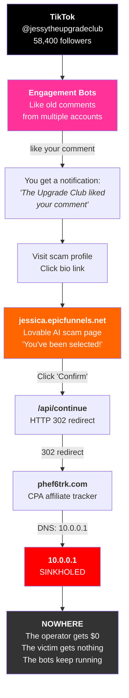
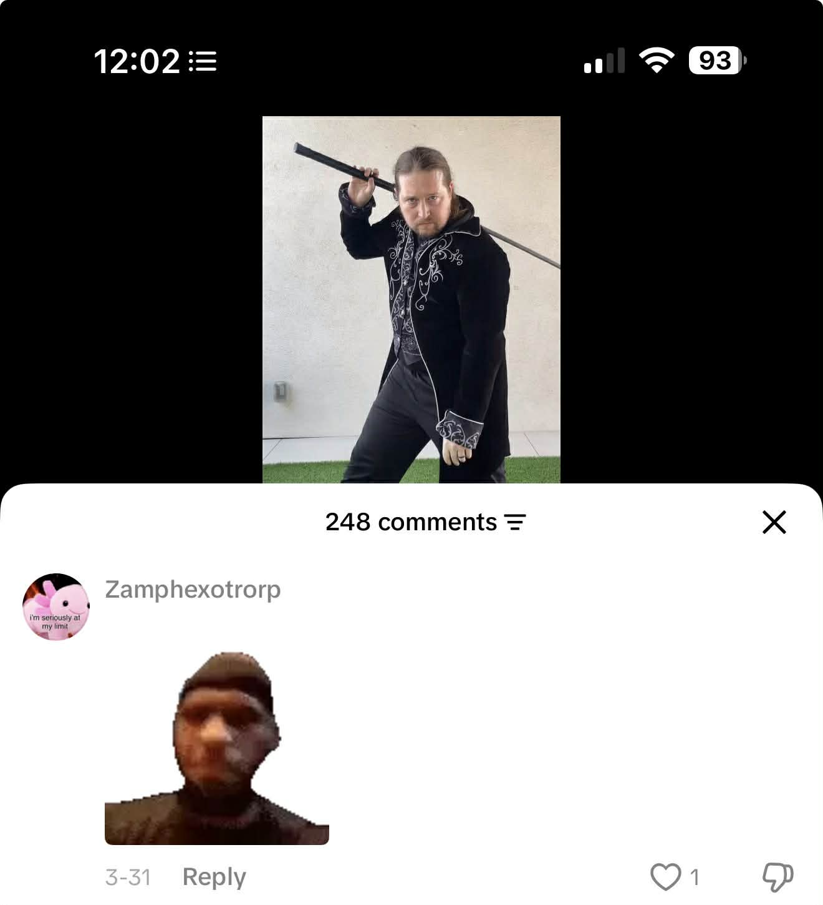
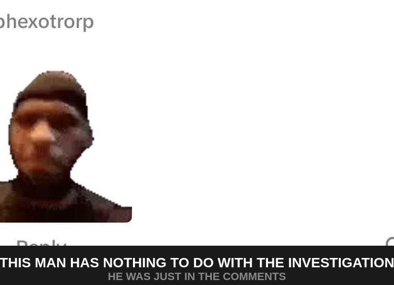
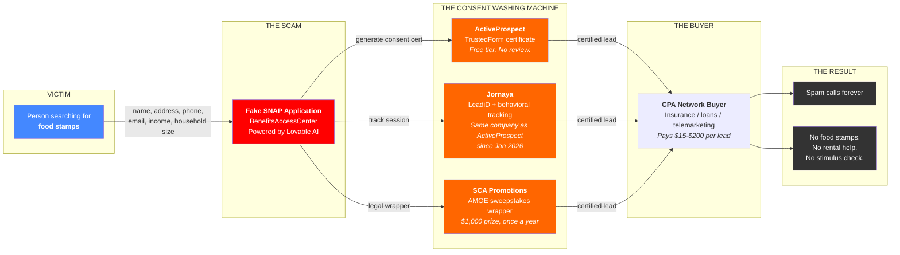

# CONGRATULATIONS!!!

## You've Been Selected to View This GitHub Repository!

> **HURRY!** Only **3 spots** remaining! (**2** people are viewing this repo right now!)

<p align="center">

</p>

---

### Dear Valued GitHub User,

Due to your **exceptional taste** in repositories, you have been **hand-selected** to receive access to this **EXCLUSIVE** collection of funny funny funny funny funny.

To confirm your entry, please complete the following steps.

### Step 1 of 3 — Choose Your Color (33%)

<p align="center">

</p>

- **Silver** (394KB WebP, served from a Google Cloud Storage bucket behind a domain called "noodledit.com")
- **Cosmic Orange** (558KB WebP, EXIF stripped so you can't trace us... except for everything else we left open)
- **Deep Blue** (477KB WebP, same 720px format as the MacBook variant we also had ready)
- **Surprise Me** (let our AI-generated page choose for you)

---

### How Did You Find This Exclusive Offer?

<p align="center">

</p>

Our **58,400 satisfied customers** at @jessytheupgradeclub agree — this is the real deal. "Premium tech drops daily. Invite-only access. Claim your spot now."

> "I'm seriously at my limit" — **Grant Klassy** (248 comments)

---

### Step 2 of 3 — View the Complete Scam Infrastructure Map (66%)

> **MANDATORY:** Before claiming your prize, you must review the **[Complete Scam Flow](https://github.com/GrantKlassy/funny/blob/main/investigations/epicfunnels/SCAM-FLOW.md)** — every domain, subdomain, DNS record, port, service, certificate, and connection mapped out in Mermaid diagrams. **This step cannot be skipped.**

---

### Included With Your Prize:

- An **AI-generated scam page** built with Lovable AI (scored 1.8/10 for scam prevention — the lowest of any tool tested)
- **10 domains**, 21 subdomains, **15 open ports**, and **0 working parts** of the actual scam

**Infrastructure:**

- A Redis database **open to the entire internet** with no password (`protected-mode: no`, `requirepass: ""`, bound to `*`) — now an **active warzone** with 218,219 connections, **23 attacker IPs from 8 countries**, crontab injection attempts, Lua RCE exploits, replication hijacking, and 337 FLUSHALL database wipes in 75 days
- A PostgreSQL database exposed to the internet (at least requires a password — `fe_sendauth: no password supplied`)
- A **dead Node.js app** returning HTTP 500 on every single endpoint
- An **expired SSL certificate** that nobody renewed (January 2026)
- The **Hestia Control Panel** admin interface exposed to the whole world on port 8083
- A secret fifth domain called **"olivimails.com"** that only appears if you connect directly to the server

**Email:**

- A DKIM key that literally says `DKIM-SUPPORT-IS-NOT-ACTIVATED`
- Two conflicting SPF records (pick one, any one)
- An SMTP server that **leaks its own internal hostname** in every banner (`ip-172-26-15-175.ec2.internal`)
- Roundcube webmail with `cookie_secure: FALSE`

**The Grand Finale:**

- A CPA affiliate tracker that got **sinkholed to `10.0.0.1`** (the entire scam funnel goes absolutely nowhere)
- An operator who is **STILL updating their SEO blog** (last modified: April 5, 2026) despite the scam being broken for months
- **500 cached Lua scripts** in Redis (someone was working hard... on something)
- A **coordinated TikTok engagement bot network** that is still actively liking people's old comments from multiple accounts, driving them to profiles that link to funnels that redirect to a sinkhole
- A Redis database that **someone else already cryptojacked** — 4 malware crontab payloads planted by **[WatchDog](https://unit42.paloaltonetworks.com/watchdog-cryptojacking/)**, a cryptojacking operation active since 2019, first exposed by Palo Alto Unit 42. Campaign ID `b2f628`, C2 domain `oracle.zzhreceive.top` (dead), XMRig Monero miner. Attack failed because Redis runs in Docker. The malware keys persist because WatchDog keeps re-injecting them after each FLUSHALL wipe by competing botnets. Scammers getting scammed by cryptojackers getting wiped by other cryptojackers.

<p align="center">

</p>

<p align="center"><em>This showed up in our TikTok notifications. While we were investigating them. The engagement bots liked our old comments on the sword guy's video. They are liking your comments right now.</em></p>

**The Redis Warzone — Who's Attacking:**

The scam operator left their Redis database open to the internet with no password. Within 75 days, **23 unique threat actors from 8 countries** found it and started fighting over it. We ran reverse DNS and WHOIS on every single one:

| Threat Level | IP | Who | Country | What They Did |
|---|---|---|---|---|
| **HIGH** | `120.48.43.118` | **Baidu Cloud** | China | `CONFIG SET dir /var/spool/cron/crontabs` — tried to write a crontab file to the host OS |
| **HIGH** | `47.112.215.87` | **Alibaba Cloud** | China | `EVAL package.loadlib` — Lua sandbox escape, attempted arbitrary code execution |
| **HIGH** | `27.185.41.158` | **ChinaNet Hebei** | China | `CONFIG SET dir /etc/cron.d` — same crontab injection, different path |
| MEDIUM | `200.188.48.146` | Unknown ISP | Mexico | `CONFIG SET stop-writes-on-bgsave-error no` — prepping for RDB payload dump |
| MEDIUM | `180.76.114.78` | **Baidu Cloud** | China | FLUSHALL + SAVE + CONFIG SET — repeated sessions over weeks |
| MEDIUM | `180.76.52.82` | **Baidu Cloud** | China | Same botnet fleet as above |
| MEDIUM | `180.76.58.237` | **Baidu Cloud** | China | Same botnet fleet as above |
| MEDIUM | `120.48.35.163` | **Baidu Cloud** | China | Same botnet fleet as above |
| MEDIUM | `183.6.4.31` | **ChinaNet Guangdong** | China | FLUSHALL + SAVE — persistent across multiple weeks |
| MEDIUM | `183.56.243.176` | **ChinaNet Guangdong** | China | FLUSHALL + SAVE |
| MEDIUM | `183.56.219.190` | **ChinaNet Guangdong** | China | FLUSHALL + SAVE |
| MEDIUM | `14.18.118.84` | **ChinaNet Guangdong** | China | FLUSHALL + SAVE |
| MEDIUM | `113.209.196.69` | **Beijing Primezone** | China | FLUSHALL + SAVE |
| MEDIUM | `116.153.32.50` | **China Unicom** | China | FLUSHALL + SAVE |
| MEDIUM | `81.71.51.170` | **Tencent Cloud** | China | FLUSHALL + SAVE |
| MEDIUM | `111.90.158.78` | **Shinjiru Technology** | Malaysia | FLUSHALL — bulletproof hosting provider popular with cybercriminals |
| MEDIUM | `198.74.62.88` | **Linode / Akamai** | USA | FLUSHALL + SAVE |
| LOW | `120.48.174.141` | Baidu Cloud | China | SAVE |
| LOW | `47.94.213.192` | Alibaba Cloud | China | SAVE |
| LOW | `118.196.34.36` | **ByteDance / Volcano Engine** | China | COMMAND recon — yes, the TikTok parent company's cloud platform |
| LOW | `194.163.170.77` | Contabo GmbH (`vmi3002568.contaboserver.net`) | Germany | SAVE + COMMAND DOCS |
| SCANNER | `3.132.26.232` | AWS (`scan.visionheight.com`) | USA | INFO — internet-wide scanner, cataloging open Redis |
| SCANNER | `130.131.161.238` | Stretchoid (`azpdcgeh5752.stretchoid.com`) | Netherlands | INFO — internet measurement company |

**74% of the attackers are Chinese cloud infrastructure.** Baidu Cloud alone has **6 IPs** in the same ASN running coordinated attacks. All three HIGH-threat actors — crontab injection, Lua RCE, cron.d injection — are on Chinese cloud platforms. The malware that successfully planted itself (WatchDog) propagates primarily through Chinese cloud infrastructure. According to Tropico Security's honeypot research, **82.5%** of all Redis attacks worldwide originate from Chinese infrastructure (Alibaba Cloud, Tencent, Baidu). Our numbers match.

The scam operator's Redis isn't just open — it's a **live battlefield** where botnets from multiple countries are competing to plant malware, wipe each other's payloads, and hijack the server's compute resources. WatchDog plants its crontab payloads. Another botnet FLUSHALLs the database. WatchDog re-injects. Someone else tries to make the server a replica. The whole thing has been wiped **337 times** in 75 days. Nobody is winning. The scam operator has no idea any of this is happening.

```mermaid
graph TD
    subgraph "THE REDIS WARZONE"
        REDIS["<b>Redis 7.4.7</b><br/>13.220.193.170:6379<br/>NO PASSWORD<br/>protected-mode: no<br/>bound to *"]
    end

    subgraph "BAIDU CLOUD BOTNET FLEET (6 IPs, AS38365)"
        B1["180.76.114.78"]
        B2["180.76.52.82"]
        B3["180.76.58.237"]
        B4["120.48.43.118<br/><b>CRONTAB INJECTION</b>"]
        B5["120.48.35.163"]
        B6["120.48.174.141"]
    end

    subgraph "OTHER CHINESE CLOUD"
        ALI1["47.112.215.87<br/><b>Alibaba Cloud</b><br/>LUA RCE ATTEMPT"]
        ALI2["47.94.213.192<br/>Alibaba Cloud"]
        TEN["81.71.51.170<br/>Tencent Cloud"]
        BYTE["118.196.34.36<br/><b>ByteDance / Volcano Engine</b><br/>yes, TikTok's parent company"]
    end

    subgraph "CHINANET (China Telecom)"
        CT1["183.6.4.31<br/>Guangdong"]
        CT2["183.56.243.176<br/>Guangdong"]
        CT3["183.56.219.190<br/>Guangdong"]
        CT4["14.18.118.84<br/>Guangdong"]
        CT5["27.185.41.158<br/>Hebei<br/><b>CRON.D INJECTION</b>"]
    end

    subgraph "REST OF WORLD"
        MX["200.188.48.146<br/>Mexico<br/>RDB attack prep"]
        MY["111.90.158.78<br/><b>Shinjiru (bulletproof hosting)</b><br/>Malaysia"]
        US1["198.74.62.88<br/>Linode / USA"]
        DE["194.163.170.77<br/>Contabo / Germany"]
    end

    subgraph "WATCHDOG MALWARE (Palo Alto Unit 42)"
        WD["backup1-backup4 keys<br/>Campaign: b2f628<br/>C2: oracle.zzhreceive.top (DEAD)<br/>Payload: XMRig Monero miner<br/><b>Active since 2019</b>"]
    end

    B1 & B2 & B3 & B4 & B5 & B6 -->|"FLUSHALL + SAVE"| REDIS
    ALI1 -->|"EVAL package.loadlib"| REDIS
    ALI2 & TEN -->|"SAVE"| REDIS
    BYTE -->|"COMMAND recon"| REDIS
    CT1 & CT2 & CT3 & CT4 -->|"FLUSHALL + SAVE"| REDIS
    CT5 -->|"CONFIG SET dir /etc/cron.d"| REDIS
    MX -->|"CONFIG SET stop-writes-on-bgsave-error no"| REDIS
    MY & US1 & DE -->|"FLUSHALL"| REDIS
    WD -.->|"persists after every wipe"| REDIS

    style REDIS fill:#ff0000,color:#fff,stroke:#fff
    style B4 fill:#ff6600,color:#fff
    style ALI1 fill:#ff6600,color:#fff
    style CT5 fill:#ff6600,color:#fff
    style WD fill:#9900cc,color:#fff
    style BYTE fill:#ff3399,color:#fff
    style MY fill:#cc6600,color:#fff
```



<p align="center"><em>23 threat actors from 8 countries fighting over one passwordless Redis. 337 database wipes in 75 days. The scam operator has no idea.</em></p>

<p align="center">

</p>

<p align="center"><em>When someone asks why your Redis has no password. Protected mode: no.</em></p>

<p align="center">

</p>

---

### But Wait, There's More

The funny part ends here.

The same operation that runs fake iPhone giveaways for TikTok teenagers also targets people who cannot afford food.

<p align="center">

</p>

<p align="center"><em>This is a stock photo from their CDN bucket. It's for their fake food stamps page.</em></p>

**70 promotional assets** in their publicly listable Google Cloud Storage bucket are dedicated to impersonating federal assistance programs — SNAP, unemployment, rental assistance, senior benefits, student aid, stimulus checks, tariff relief, child/family assistance — operated under a dedicated brand called **BenefitsAccessCenter**.

<p align="center">


</p>

<p align="center"><em>Senior benefits. Student aid. Rental assistance. All from the same CDN that serves the iPhone scam.</em></p>

<p align="center">


</p>

<p align="center"><em>Unemployment benefits (with the Capitol building for legitimacy). "Startup grants" (a briefcase full of cash).</em></p>

<p align="center">


</p>

<p align="center"><em>SNAP benefits with stock groceries. This is what they show people who can't afford food. The groceries are from a stock photo. The benefits don't exist. The data goes to telemarketers.</em></p>

The victim enters their personal information — name, address, phone, email, income, household size — believing they're applying for assistance. The data gets sold as CPA leads. The victim gets nothing. No food stamps. No rental help. No stimulus check. Spam calls and a data broker list.

The entity behind it: **[Moxxi Digital, LLC](investigations/epicfunnels/OPERATOR-INTEL.md)** (`moxximedia.onmicrosoft.com`), founded by ex-Fluent Inc. executives whose previous company was sued by the FTC for the exact same scam. 15+ brand names. 747 assets in their CDN. New material uploaded the day we investigated.

**[Full evidence: investigations/epicfunnels/](investigations/epicfunnels/)** — 70 assets catalogued, 10 captured as evidence, complete timeline of the pivot into government benefits fraud.

---

### Recent Viewers:

| | Name | Status |
|---|------|--------|
| :bust_in_silhouette: | Jessica from TikTok | Won an iPhone 17 Pro Max! |
| :bust_in_silhouette: | Jenny from TikTok | DNS removed |
| :bust_in_silhouette: | Kylie from TikTok | DNS removed |
| :bust_in_silhouette: | Grant Klassy | Seriously at his limit |
| :bust_in_silhouette: | Someone from the Zendesk SPF record | Confused |
| :bust_in_silhouette: | The Redis database | Active warzone (218K connections, 23 attackers from 8 countries, WatchDog cryptojacker, 337 FLUSHALL) |
| :bust_in_silhouette: | ActiveProspect TCPA verification | Definitely legit lead gen |
| :bust_in_silhouette: | The engagement bots | Still liking old TikTok comments (into a sinkhole) |
| :bust_in_silhouette: | Morris Laniado | President, Moxxi Digital. Ex-Fluent Inc. AVP Data Revenue. Lives near the UPS Store. |
| :bust_in_silhouette: | Jeffrey Kauffman | General Counsel. Built the same TrustedForm stack at Fluent. Third company to get regulatory heat. |
| :bust_in_silhouette: | The operator | Still updating the SEO blog |
| :bust_in_silhouette: | The Node.js app | HTTP 500 Internal Server Error |
| :bust_in_silhouette: | fqdn.olivimails.com | Coming Soon |
| :bust_in_silhouette: | The guy with the sword | Unclear |

---

### To Claim Your Prize:

<p align="center">

</p>

<p align="center"><em>or, if you prefer (also actual size)</em></p>

1. Click "Confirm"
2. Answer a "survey"
3. Get redirected to `phef6trk.com/FGK5P4/2Z57CD5/`
4. That domain resolves to `10.0.0.1`
5. You are now nowhere
6. The operator gets paid per click (or would, if the tracker worked)
7. It doesn't
8. The Node.js backend that was supposed to handle this returns HTTP 500 on literally every endpoint
9. The countdown timer shows `NaN:NaN:NaN`
10. The SSL cert expired in January
11. Nobody renewed it



<p align="center"><em>The entire scam funnel. From TikTok engagement bot to sinkhole. Every step documented. Every endpoint probed. It goes nowhere.</em></p>

---

<p align="center">

</p>

---

## Proof of Legitimacy

**Exhibit A:**

<p align="center">

</p>

This page was professionally built using Lovable AI ("Build something lovable"). Lovable scored **1.8 out of 10** for scam prevention in Guardio Labs' VibeScamming research. That's the lowest score of any tool tested. They built something lovable, all right.

The Upgrade Club liked your comment. This is real engagement from a real scam operation with 58,400 real followers. They liked our comment on a video of a man with a sword. We feel special.

<p align="center">

</p>

<p align="center"><em>The video. The comments. The sword. The man. 248 comments. This is where the investigation started.</em></p>

<p align="center">

</p>

<p align="center"><em>This man has nothing to do with the investigation. He was just in the comments.</em></p>

**Exhibit B:**

<p align="center">

</p>

The engagement bots are still running. The tracker is sinkholed. The machine runs. The gears turn. Nothing happens.

**Exhibit C:**

<p align="center">

</p>

<p align="center"><em>This is the actual promotional image from their CDN bucket at b.noodledit.com. "Valued at $1000." The filename is literally <code>iphone17promax1000.png</code>. The $1000 is the value, not the price. There is no iPhone. There is no prize. There is a $1,000 cash drawing once a year, administered by a company founded by a professional bridge player in Dallas.</em></p>

**Exhibit D:**

<p align="center">

</p>

Where this investigation falls on the privacy iceberg.

---

## Step 3 of 3 — Meet the Companies (100%)

The scam doesn't work without a legal shield. These are the companies that provide it.

### The Consent Washing Machine

The victim enters their personal information on a fake government benefits page. They think they're applying for food stamps. Here's what actually happens to their data:

1. **[ActiveProspect](https://activeprospect.com/)** (Austin, TX) generates a **TrustedForm certificate** — a "Certificate of Authenticity" that "proves" the victim consented to be contacted. [TrustedForm Certify is free](https://activeprospect.com/blog/trustedform-setup/). Sign up online. Verify your domain via DNS TXT record. No human reviews what the page actually does. A fake SNAP application gets the same certificate as a legitimate insurance quote.

2. **[Jornaya](https://www.jornaya.com/)** assigns a **LeadiD** and tracks the victim's session — pages visited, time on page, form interactions. This behavioral data follows the lead through the pipeline. Downstream buyers check the Jornaya record before purchasing. **[Jornaya and ActiveProspect are now the same company](https://www.globenewswire.com/news-release/2026/01/08/3215813/0/en/Verisk-Announces-Sale-of-its-Marketing-Solutions-Business-to-ActiveProspect.html)** — ActiveProspect acquired Verisk Marketing Solutions (Jornaya + Infutor) on January 8, 2026. The scam's privacy policy still references them as separate vendors. They aren't. One company provides both layers of "independent" consent verification. Combined, they certify over **1 billion opt-in leads annually**.

3. **[SCA Promotions](https://scapromotions.com/)** (Dallas, TX) provides the **sweepstakes legal wrapper** via their [EasyScan AMOE](https://scapromotions.com/easyscanamoe/) system. US law requires every sweepstakes to offer a free entry method. SCA's AMOE system satisfies this requirement, preventing the FTC from classifying the operation as an illegal lottery. SCA is the **prize administrator** — the grand prize is one $1,000 cash drawing per year. Founded in 1986 by professional bridge player Bob Hamman. [Not BBB accredited](https://www.bbb.org/us/tx/dallas/profile/advertising-agencies/s-c-a-promotions-0875-29865).

The lead is now packaged with a TrustedForm consent certificate, a Jornaya behavioral profile, and AMOE sweepstakes compliance. It is sold to CPA network buyers — insurance companies, loan providers, telemarketers — who can point to all of this documentation as proof they followed the law. The victim gets spam calls. No food stamps. No rental help. No stimulus check.

Total cost of this legal cover to the scammer: **approximately nothing.** TrustedForm Certify is free. Jornaya's JS tag is free to embed. SCA charges for prize administration, but the "prize" is $1,000 once a year. Total harm: industrial scale.



<p align="center"><em>The victim thinks they're applying for food stamps. Their data gets "consent washed" through three vendors (two of which are now the same company), packaged as a certified lead, and sold to telemarketers. The whole legal shield costs the scammer approximately nothing.</em></p>

### The "Office"

Both MyAmericanPrizes and MyDailySurge list their sponsor address as:

> **68 White Street, Suite 7-291, Red Bank, NJ 07701**

This is **[The UPS Store #3488](https://locations.theupsstore.com/nj/red-bank/68-white-st)**.

"Suite 7" is the UPS Store's suite number in the building. "291" is the mailbox number. UPS Store mailboxes provide a street address instead of a PO Box — so a rented mailbox looks like a real office. The operation that runs 15+ brands, 747 CDN assets, fake government benefit portals, and an active TikTok bot network operates out of a mailbox in a strip mall in Red Bank, New Jersey.

The mail-in sweepstakes entry address goes to SCA Promotions at 3030 LBJ Freeway, Suite 300, Dallas, TX 75234. The Zendesk help center is at `mydailysurge.zendesk.com`. The contact email is `support@mydailysurge.com`. The terms and conditions are governed by Texas law. Mandatory arbitration. 30-day opt-out window.

### Who Runs This

**[Moxxi Digital, LLC](https://www.linkedin.com/company/moxxi-digital)** (EIN 93-2214452), operating as Moxxi Media and Reward Zinga. 85 Broad Street, New York, NY 10004 (WeWork). Legal address: UPS Store #3488, 68 White St #7-291, Red Bank, NJ 07701 — the same mailbox as the MyAmericanPrizes sweepstakes sponsor.

The BBB profile lists Moxxi Digital d/b/a "Reward Zinga" at that UPS Store address. The [RewardZinga terms and conditions](https://9.rewardzinga1.com/rewards-terms-and-conditions) carry the copyright notice *"(c) My American Prizes, 2024."* **Moxxi Digital = Reward Zinga = My American Prizes = this scam.**

Founded by veterans of **[Fluent, Inc.](https://www.fluentco.com/)** (NASDAQ: FLNT) — a publicly traded performance marketing company the **[FTC sued in July 2023](https://www.ftc.gov/legal-library/browse/cases-proceedings/1923230-fluent-llc-us-v)** for operating **"consent farms"** that sold **620 million+ telemarketing leads** using fake sweepstakes and $1,000 Walmart gift card offers. Fluent paid **$2.5 million** to the FTC, **$3.7 million** to the NY Attorney General (for fabricating millions of fake net neutrality comments), **$250,000** to the PA Attorney General (for selling 4.2 million consumers' data to telemarketers), and was co-defendant in a **$9.75 million TCPA class action**. Total regulatory damage: **~$16.2 million**.

The Moxxi Digital leadership team rebuilt the same operation as a private company:

| Name | Moxxi Digital Role | What They Did at Fluent |
|------|--------------------|------------------------|
| **[Morris Laniado](https://www.linkedin.com/in/morris-laniado-0958384)** | President & Co-Founder | **Associate VP, Data Revenue** — ran the team that sold Fluent's consent farm leads. Previously SVP Marketing at SelectQuote Insurance Services (insurance lead gen). Lives in Monmouth County, NJ. His previous company (Jade Global Group LLC) is registered in Red Bank — the same town as the UPS Store mailbox. |
| **[Kevin Riehl](https://www.linkedin.com/in/kevriehl/)** | CPO & Co-Founder | **Director of Product Management** — built "The Smart Wallet," one of Fluent's reward/offer wall properties. Education: Rutgers, NJ. |
| **[Jeffrey Kauffman](https://www.linkedin.com/in/jeffreyakauffman/)** | General Counsel | **Co-General Counsel & Chief Compliance Officer** — managed Fluent's regulatory compliance during the FTC investigation. In November 2019, [announced](https://activeprospect.com/blog/fluent-inc-announces-implementation-of-trustedform/) Fluent's deployment of ActiveProspect TrustedForm. Now deploys the same technology at Moxxi on epicfunnels.net and myamericanprizes.com. Previously at Affinion Group ($30 million settlement across 46 states for deceptive enrollment). |
| **Carl Augustin** | VP, Media & Business Development | **Director of Publisher Development** — 7 years at Fluent (2015-2022). Founding member of Fluent, Inc. (2011). |

Fluent's subsidiary **American Prize Center LLC** was incorporated in 2012 with CEO Ryan Schulke and President Matthew Conlin (Fluent's founders). The scam operation's flagship brand is **MyAmericanPrizes**. The naming is not coincidental.

`moxxi.io` was registered **May 23, 2023** — two months before the FTC sued Fluent. `myamericanprizes.com` was registered **August 22, 2023** — one month after. They were already building the exit.

```mermaid
timeline
    title The Fluent-to-Moxxi Pipeline
    section Fluent Inc (NASDAQ: FLNT)
        2012 : American Prize Center LLC incorporated
             : (CEO Ryan Schulke, President Matthew Conlin)
        2015-2022 : Carl Augustin at Fluent (7 years, founding member)
        2018-2019 : Fluent sells 620M+ consent farm leads ($93.4M revenue)
        Nov 2019 : Jeffrey Kauffman deploys TrustedForm at Fluent
    section The Exit
        May 2023 : moxxi.io registered (2 months BEFORE FTC suit)
        Jul 2023 : FTC sues Fluent ($2.5M settlement)
        Aug 2023 : myamericanprizes.com registered (1 month AFTER)
             : Name echoes Fluent's "American Prize Center LLC"
    section Moxxi Digital
        2023-2024 : Same playbook, same vendors (ActiveProspect + Jornaya)
             : Same people (Laniado, Riehl, Kauffman, Augustin)
        2025-2026 : 15+ brands, 747 CDN assets, gov benefits fraud
             : epicfunnels.net, BenefitsAccessCenter, RewardZinga
             : BBB rated D+. No FTC action yet.
```

Moxxi Digital acquires leads at **$1.44-$2.00** via fake sweepstakes (confirmed via [Affplus CPA listings](https://www.affplus.com/search?q=myamericanprizes)). The same leads, enriched with personal/financial data and packaged with TCPA consent certificates, sell into health insurance and lending verticals at **$15-$200+ each**. 36 employees. Bootstrapped. Profitable. Actively hiring via [Greenhouse](https://job-boards.greenhouse.io/moxxidigital).

No FTC action against Moxxi Digital yet.

**[Full operator attribution chain: investigations/epicfunnels/OPERATOR-INTEL.md](investigations/epicfunnels/OPERATOR-INTEL.md)**

### The Full Picture

**[investigations/epicfunnels/THIRD-PARTY-INTEL.md](investigations/epicfunnels/THIRD-PARTY-INTEL.md)** — Complete deep dive into ActiveProspect, Jornaya, SCA Promotions, and the Moxxi Media entity. Company profiles, leadership, the acquisition timeline, how TrustedForm works, how scammers abuse it, the UPS Store reveal, and the full consent-washing pipeline mapped end to end.

---

## The Actual Investigation

If, somehow, you are still reading and want the real technical details:

**[investigations/epicfunnels/](investigations/epicfunnels/)** — Full write-up of a CPA affiliate scam operation run by Moxxi Digital (ex-Fluent Inc. alumni), built with Lovable AI, distributed via TikTok, running on a hilariously misconfigured AWS EC2 instance with 10 domains, 15 open ports, 15+ brands, 747 CDN assets, fake government benefit portals targeting people in financial distress, a Redis that has become an active warzone (218K connections, 23 attacker IPs from 8 countries, crontab injection, Lua RCE exploits, 337 database wipes, WatchDog cryptojacker, a 6-IP Baidu Cloud botnet fleet), a shadow hostname called "olivimails.com" (now expired), a Hestia Control Panel login page visible to the entire internet, and an operator who is *still actively uploading new scam assets* despite the fact that the monetization has been broken for months. Plus a [complete chain of attribution](investigations/epicfunnels/OPERATOR-INTEL.md) from scam landing page to real humans. Plus full [threat actor attribution](investigations/epicfunnels/artifacts/new-ports-2026-04-09/threat-actor-attribution.json) on every IP that attacked the Redis.

**:world_map: [THE COMPLETE SCAM FLOW](https://github.com/GrantKlassy/funny/blob/main/investigations/epicfunnels/SCAM-FLOW.md)** — Every domain, subdomain, DNS record, port, service, certificate, and connection mapped out in Mermaid diagrams. The crown jewel. GitHub renders the Mermaid live.

**:bust_in_silhouette: [OPERATOR INTELLIGENCE](investigations/epicfunnels/OPERATOR-INTEL.md)** — The complete chain of attribution from scam landing page to real human beings. Who they are, where they came from, why they do it, and how much they make.

**[investigations/epicfunnels/tiktok/](investigations/epicfunnels/tiktok/)** — TikTok distribution evidence (profile, comments, scam page screenshots, and yes, the sword guy).

**[memes/](memes/)** — The memes.

---

### By The Numbers

- **1** operating entity: **Moxxi Digital, LLC** (d/b/a Moxxi Media, d/b/a Reward Zinga, d/b/a My American Prizes)
- **4** ex-Fluent Inc executives running the show
- **$16.2 million** in regulatory penalties at their previous employer (FTC + NY AG + PA AG + TCPA class action)
- **$93.4 million** in revenue Fluent made selling 620M+ consent farm leads (2018-2019) — the business model Moxxi Digital replicated
- **10** connected domains (epicfunnels.net, noodledit.com, mydailysurge.com, phef6trk.com, myamericanprizes.com, olivimails.com, rewardzinga.com, easyscanamoe.com, snagalot.com, myamericanprizes1.com)
- **15+** brand names
- **747** assets in the GCS CDN bucket (publicly listable, actively updated)
- **218,219** connections to the exposed Redis in 75 days (it never stops)
- **23** unique attacker IPs in the Redis slowlog from **8 countries** — 74% Chinese cloud infrastructure (scammers getting scammed by botnets)
- **337** FLUSHALL commands (complete database wipes by automated attackers)
- **4,355** SLAVEOF commands (replication hijack attempts)
- **1,455** Lua EVAL commands (RCE exploit attempts, all failed)
- **6** Baidu Cloud IPs in a single coordinated botnet fleet (AS38365)
- **70** promotional assets impersonating government benefit programs
- **15** open ports on one EC2 instance (4 new: FTP, DNS, POP3, POP3S — discovered via full 65535 port sweep)
- **11** categories of government assistance being faked
- **7** affiliate IDs through one tracker
- **500** cached Lua scripts in Redis (from EVAL spam by botnets)
- **4** cryptojacking malware payloads in Redis — **WatchDog** (Palo Alto Unit 42, active since 2019, campaign `b2f628`, C2 `oracle.zzhreceive.top`)
- **3** third-party companies providing legal cover (ActiveProspect, SCA Promotions, EasyScan AMOE)
- **2** TCPA compliance vendors that are actually the same company (ActiveProspect acquired Jornaya, Jan 2026)
- **2** confirmed crontab injection attempts (`CONFIG SET dir /var/spool/cron/crontabs` and `CONFIG SET dir /etc/cron.d`)
- **2** conflicting SPF records
- **2** Microsoft 365 tenants (one deleted, one active)
- **1** DKIM key that says "NOT ACTIVATED"
- **1** sinkholed tracker
- **1** dead Node.js app
- **1** completely open Redis (now an active warzone — 23 threat actors, 8 countries, 5 attack types, WatchDog cryptojacker, Baidu Cloud botnet fleet)
- **1** PostgreSQL database on the public internet (at least requires a password)
- **1** admin panel exposed to the world (API IP-whitelisted — the one thing they secured)
- **1** engagement bot network still grinding (into a sinkhole)
- **1** expired domain still used as a server hostname
- **1** UPS Store mailbox pretending to be a corporate office (Red Bank, NJ)
- **1** professional bridge player's company administering the "prize" (SCA Promotions, Dallas TX)
- **1** Lua RCE exploit attempt using `package.loadlib` against the Redis (Alibaba Cloud, China)
- **1** ByteDance/Volcano Engine IP doing recon on the Redis (yes, the TikTok parent company's cloud)
- **1** guy with a sword (unrelated)
- **1** billion leads certified annually by the consent verification monopoly enabling this
- **$1,000** — the grand prize (one winner per year, random drawing, good luck)
- **0** working parts of the actual scam

---

```
funny funny funny funny funny
```
