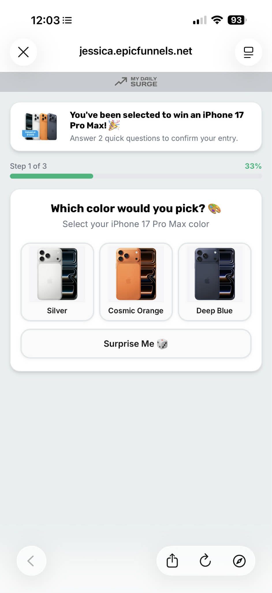
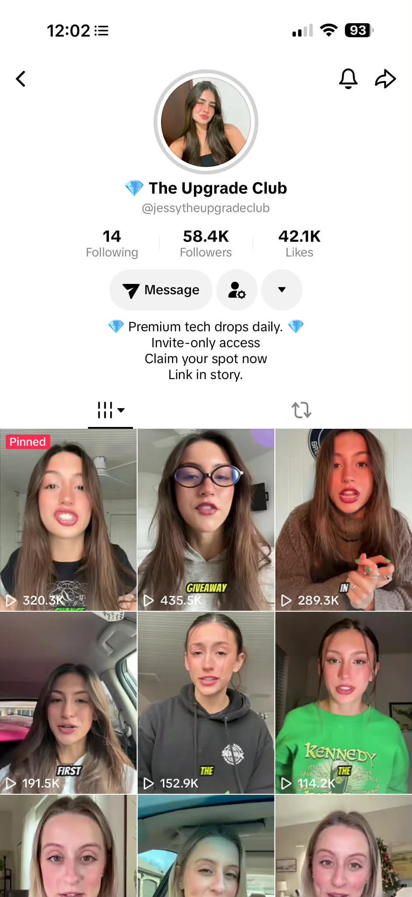
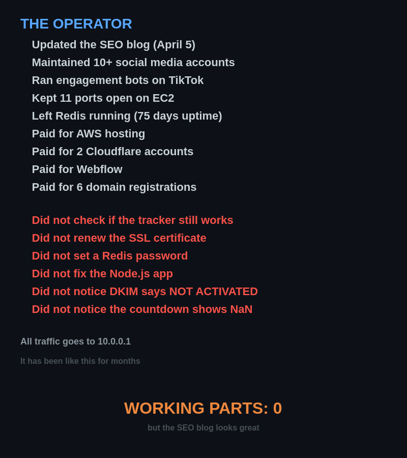
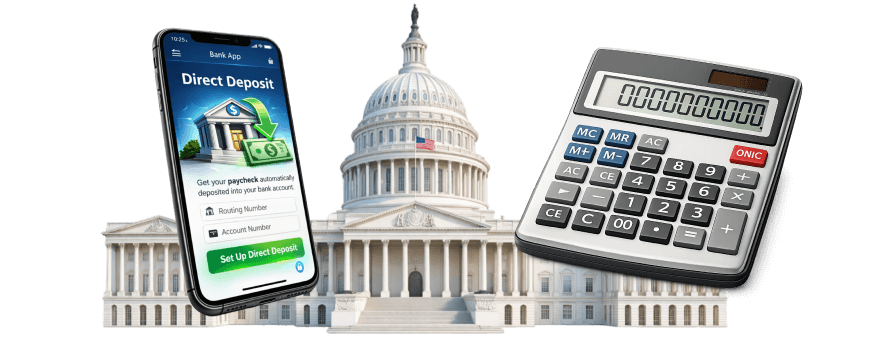
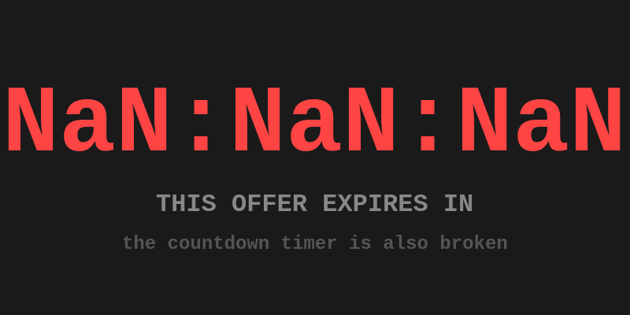
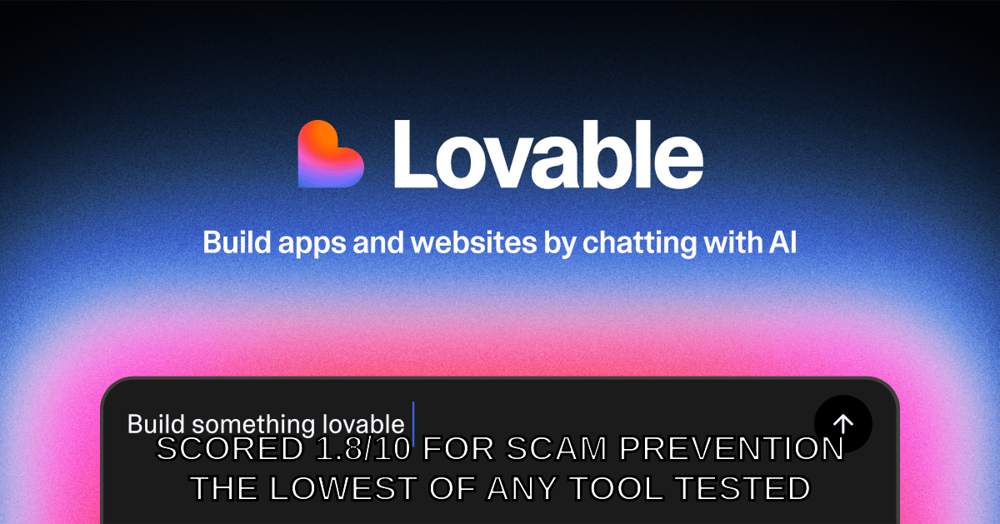
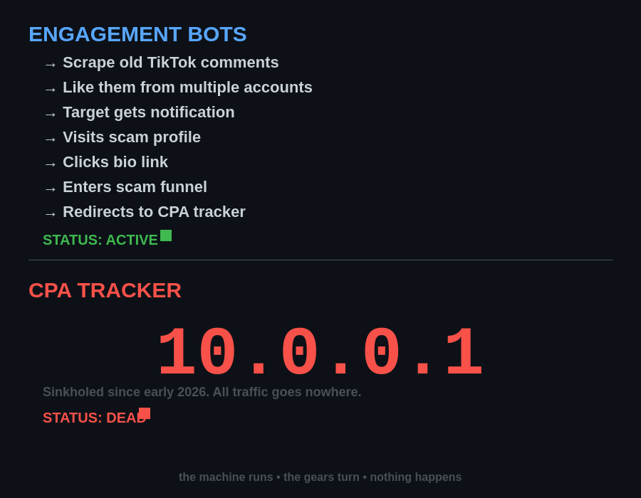

# CONGRATULATIONS!!!

## You've Been Selected to View This GitHub Repository!

> **HURRY!** Only **3 spots** remaining! (**2** people are viewing this repo right now!)

<p align="center">

</p>

---

### Dear Valued GitHub User,

Due to your **exceptional taste** in repositories, you have been **hand-selected** to receive access to this **EXCLUSIVE** collection of funny funny funny funny funny.

To confirm your entry, please complete the following steps.

### Step 1 of 3 — Choose Your Color (33%)

<p align="center">

</p>

- **Silver** (394KB WebP, served from a Google Cloud Storage bucket behind a domain called "noodledit.com")
- **Cosmic Orange** (558KB WebP, EXIF stripped so you can't trace us... except for everything else we left open)
- **Deep Blue** (477KB WebP, same 720px format as the MacBook variant we also had ready)
- **Surprise Me** (let our AI-generated page choose for you)

---

### How Did You Find This Exclusive Offer?

<p align="center">

</p>

Our **58,400 satisfied customers** at @jessytheupgradeclub agree — this is the real deal. "Premium tech drops daily. Invite-only access. Claim your spot now."

> "I'm seriously at my limit" — **Grant Klassy** (248 comments)

---

### Step 2 of 3 — View the Complete Scam Infrastructure Map (66%)

> **MANDATORY:** Before claiming your prize, you must review the **[Complete Scam Flow](https://github.com/GrantKlassy/funny/blob/main/investigations/epicfunnels/SCAM-FLOW.md)** — every domain, subdomain, DNS record, port, service, certificate, and connection mapped out in Mermaid diagrams. **This step cannot be skipped.**

---

### Included With Your Prize:

- An **AI-generated scam page** built with Lovable AI (scored 1.8/10 for scam prevention — the lowest of any tool tested)
- **6 domains**, 21 subdomains, 11 open ports, and **0 working parts** of the actual scam

**Infrastructure:**

- A Redis database **open to the entire internet** with no password (`protected-mode: no`, `requirepass: ""`, bound to `*`)
- A PostgreSQL database **also open to the entire internet**
- A **dead Node.js app** returning HTTP 500 on every single endpoint
- An **expired SSL certificate** that nobody renewed (January 2026)
- The **Hestia Control Panel** admin interface exposed to the whole world on port 8083
- A secret fifth domain called **"olivimails.com"** that only appears if you connect directly to the server

**Email:**

- A DKIM key that literally says `DKIM-SUPPORT-IS-NOT-ACTIVATED`
- Two conflicting SPF records (pick one, any one)
- An SMTP server that **leaks its own internal hostname** in every banner (`ip-172-26-15-175.ec2.internal`)
- Roundcube webmail with `cookie_secure: FALSE`

**The Grand Finale:**

- A CPA affiliate tracker that got **sinkholed to `10.0.0.1`** (the entire scam funnel goes absolutely nowhere)
- An operator who is **STILL updating their SEO blog** (last modified: April 5, 2026) despite the scam being broken for months
- **500 cached Lua scripts** in Redis (someone was working hard... on something)
- A **coordinated TikTok engagement bot network** that is still actively liking people's old comments from multiple accounts, driving them to profiles that link to funnels that redirect to a sinkhole
- A Redis database that **someone else already tried to cryptojack** — 4 malware crontab payloads sitting in the keys, phoning home to a dead C2 domain. Scammers getting scammed.

<p align="center">

</p>

---

### But Wait, There's More

The funny part ends here.

The same operation that runs fake iPhone giveaways for TikTok teenagers also targets people who cannot afford food.

<p align="center">

</p>

<p align="center"><em>This is a stock photo from their CDN bucket. It's for their fake food stamps page.</em></p>

**70 promotional assets** in their publicly listable Google Cloud Storage bucket are dedicated to impersonating federal assistance programs — SNAP, unemployment, rental assistance, senior benefits, student aid, stimulus checks, tariff relief, child/family assistance — operated under a dedicated brand called **BenefitsAccessCenter**.

<p align="center">


</p>

<p align="center"><em>Senior benefits. Student aid. Rental assistance. All from the same CDN that serves the iPhone scam.</em></p>

<p align="center">



</p>

<p align="center"><em>Unemployment benefits (with the Capitol building for legitimacy). "Startup grants" (a briefcase full of cash).</em></p>

The victim enters their personal information — name, address, phone, email, income, household size — believing they're applying for assistance. The data gets sold as CPA leads. The victim gets nothing. No food stamps. No rental help. No stimulus check. Spam calls and a data broker list.

The entity behind it: **Moxxi Media** (`moxximedia.onmicrosoft.com`). 15+ brand names. 747 assets in their CDN. New material uploaded the day we investigated.

**[Full evidence: investigations/epicfunnels/](investigations/epicfunnels/)** — 70 assets catalogued, 10 captured as evidence, complete timeline of the pivot into government benefits fraud.

---

### Recent Viewers:

| | Name | Status |
|---|------|--------|
| :bust_in_silhouette: | Jessica from TikTok | Won an iPhone 17 Pro Max! |
| :bust_in_silhouette: | Jenny from TikTok | DNS removed |
| :bust_in_silhouette: | Kylie from TikTok | DNS removed |
| :bust_in_silhouette: | Grant Klassy | Seriously at his limit |
| :bust_in_silhouette: | Someone from the Zendesk SPF record | Confused |
| :bust_in_silhouette: | The Redis database | Exposed (no auth, all interfaces, 75 days uptime) |
| :bust_in_silhouette: | ActiveProspect TCPA verification | Definitely legit lead gen |
| :bust_in_silhouette: | The engagement bots | Still liking old TikTok comments (into a sinkhole) |
| :bust_in_silhouette: | The operator | Still updating the SEO blog |
| :bust_in_silhouette: | The Node.js app | HTTP 500 Internal Server Error |
| :bust_in_silhouette: | fqdn.olivimails.com | Coming Soon |
| :bust_in_silhouette: | The guy with the sword | Unclear |

---

### To Claim Your Prize:

<p align="center">

</p>

<p align="center"><em>or, if you prefer (also actual size)</em></p>

1. Click "Confirm"
2. Answer a "survey"
3. Get redirected to `phef6trk.com/FGK5P4/2Z57CD5/`
4. That domain resolves to `10.0.0.1`
5. You are now nowhere
6. The operator gets paid per click (or would, if the tracker worked)
7. It doesn't
8. The Node.js backend that was supposed to handle this returns HTTP 500 on literally every endpoint
9. The countdown timer shows `NaN:NaN:NaN`
10. The SSL cert expired in January
11. Nobody renewed it

---

<p align="center">

</p>

---

## Proof of Legitimacy

**Exhibit A:**

<p align="center">

</p>

This page was professionally built using Lovable AI ("Build something lovable"). Lovable scored **1.8 out of 10** for scam prevention in Guardio Labs' VibeScamming research. That's the lowest score of any tool tested. They built something lovable, all right.

The Upgrade Club liked your comment. This is real engagement from a real scam operation with 58,400 real followers. They liked our comment. We feel special.

**Exhibit B:**

<p align="center">

</p>

The engagement bots are still running. The tracker is sinkholed. The machine runs. The gears turn. Nothing happens.

**Exhibit D:**

<p align="center">

</p>

Where this investigation falls on the privacy iceberg.

---

## Step 3 of 3 — Meet the Companies (100%)

The scam doesn't work without a legal shield. These are the companies that provide it.

### The Consent Washing Machine

The victim enters their personal information on a fake government benefits page. They think they're applying for food stamps. Here's what actually happens to their data:

1. **[ActiveProspect](https://activeprospect.com/)** (Austin, TX) generates a **TrustedForm certificate** — a "Certificate of Authenticity" that "proves" the victim consented to be contacted. [TrustedForm Certify is free](https://activeprospect.com/blog/trustedform-setup/). Sign up online. Verify your domain via DNS TXT record. No human reviews what the page actually does. A fake SNAP application gets the same certificate as a legitimate insurance quote.

2. **[Jornaya](https://www.jornaya.com/)** assigns a **LeadiD** and tracks the victim's session — pages visited, time on page, form interactions. This behavioral data follows the lead through the pipeline. Downstream buyers check the Jornaya record before purchasing. **[Jornaya and ActiveProspect are now the same company](https://www.globenewswire.com/news-release/2026/01/08/3215813/0/en/Verisk-Announces-Sale-of-its-Marketing-Solutions-Business-to-ActiveProspect.html)** — ActiveProspect acquired Verisk Marketing Solutions (Jornaya + Infutor) on January 8, 2026. The scam's privacy policy still references them as separate vendors. They aren't. One company provides both layers of "independent" consent verification. Combined, they certify over **1 billion opt-in leads annually**.

3. **[SCA Promotions](https://scapromotions.com/)** (Dallas, TX) provides the **sweepstakes legal wrapper** via their [EasyScan AMOE](https://scapromotions.com/easyscanamoe/) system. US law requires every sweepstakes to offer a free entry method. SCA's AMOE system satisfies this requirement, preventing the FTC from classifying the operation as an illegal lottery. SCA is the **prize administrator** — the grand prize is one $1,000 cash drawing per year. Founded in 1986 by professional bridge player Bob Hamman. [Not BBB accredited](https://www.bbb.org/us/tx/dallas/profile/advertising-agencies/s-c-a-promotions-0875-29865).

The lead is now packaged with a TrustedForm consent certificate, a Jornaya behavioral profile, and AMOE sweepstakes compliance. It is sold to CPA network buyers — insurance companies, loan providers, telemarketers — who can point to all of this documentation as proof they followed the law. The victim gets spam calls. No food stamps. No rental help. No stimulus check.

Total cost of this legal cover to the scammer: **approximately nothing.** TrustedForm Certify is free. Jornaya's JS tag is free to embed. SCA charges for prize administration, but the "prize" is $1,000 once a year. Total harm: industrial scale.

### The "Office"

Both MyAmericanPrizes and MyDailySurge list their sponsor address as:

> **68 White Street, Suite 7-291, Red Bank, NJ 07701**

This is **[The UPS Store #3488](https://locations.theupsstore.com/nj/red-bank/68-white-st)**.

"Suite 7" is the UPS Store's suite number in the building. "291" is the mailbox number. UPS Store mailboxes provide a street address instead of a PO Box — so a rented mailbox looks like a real office. The operation that runs 15+ brands, 747 CDN assets, fake government benefit portals, and an active TikTok bot network operates out of a mailbox in a strip mall in Red Bank, New Jersey.

The mail-in sweepstakes entry address goes to SCA Promotions at 3030 LBJ Freeway, Suite 300, Dallas, TX 75234. The Zendesk help center is at `mydailysurge.zendesk.com`. The contact email is `support@mydailysurge.com`. The terms and conditions are governed by Texas law. Mandatory arbitration. 30-day opt-out window.

### Who Is Moxxi Media?

The M365 tenant behind myamericanprizes.com is `moxximedia.onmicrosoft.com`. The domain `moxximedia.com` is not registered. They exist only as a Microsoft 365 tenant — a ghost.

There is a company called **[Moxxi Digital](https://www.linkedin.com/company/moxxi-digital)** in New York City. It was co-founded by **Morris Laniado**, previously of **[Fluent, Inc.](https://www.linkedin.com/in/morris-laniado-0958384)** (NYSE: FLNT) — one of the largest publicly traded performance marketing and lead generation companies in the United States. Moxxi Digital's business is described as "promotion-based marketing that drives lead opt-in lead generation and ROI-focused customer acquisition at scale." That is a precise description of what this scam operation does.

The M365 tenant says `moxxiMEDIA`. The public company calls itself `moxxiDIGITAL`. This could be a rebrand, a subsidiary, a DBA, or a completely different entity. **This is not a confirmed identification.** But the business model alignment — CPA lead generation via promotions, at scale, using AI and proprietary adtech — is exact.

### The Full Picture

**[investigations/epicfunnels/THIRD-PARTY-INTEL.md](investigations/epicfunnels/THIRD-PARTY-INTEL.md)** — Complete deep dive into ActiveProspect, Jornaya, SCA Promotions, and the Moxxi Media entity. Company profiles, leadership, the acquisition timeline, how TrustedForm works, how scammers abuse it, the UPS Store reveal, and the full consent-washing pipeline mapped end to end.

---

## The Actual Investigation

If, somehow, you are still reading and want the real technical details:

**[investigations/epicfunnels/](investigations/epicfunnels/)** — Full write-up of a CPA affiliate scam operation run by Moxxi Media, built with Lovable AI, distributed via TikTok, running on a hilariously misconfigured AWS EC2 instance with 9 domains, 15+ brands, 747 CDN assets, fake government benefit portals targeting people in financial distress, a Redis that got cryptojacked by a third party, a shadow hostname called "olivimails.com" (now expired), a Hestia Control Panel login page visible to the entire internet, and an operator who is *still actively uploading new scam assets* despite the fact that the monetization has been broken for months.

**:world_map: [THE COMPLETE SCAM FLOW](https://github.com/GrantKlassy/funny/blob/main/investigations/epicfunnels/SCAM-FLOW.md)** — Every domain, subdomain, DNS record, port, service, certificate, and connection mapped out in Mermaid diagrams. The crown jewel. GitHub renders the Mermaid live.

**[investigations/epicfunnels/tiktok/](investigations/epicfunnels/tiktok/)** — TikTok distribution evidence (profile, comments, scam page screenshots, and yes, the sword guy).

**[memes/](memes/)** — The memes.

---

### By The Numbers

- **1** operating entity identified: Moxxi Media
- **9** connected domains (was 7 — snagalot.com, myamericanprizes1.com added)
- **15+** brand names
- **747** assets in the GCS CDN bucket (publicly listable, actively updated)
- **70** promotional assets impersonating government benefit programs
- **11** categories of government assistance being faked
- **11** open ports on EC2
- **7** affiliate IDs through one tracker
- **500** cached Lua scripts in Redis
- **4** cryptojacking malware payloads in Redis (from a third party — scammers getting scammed)
- **3** third-party companies providing legal cover (ActiveProspect, SCA Promotions, EasyScan AMOE)
- **2** TCPA compliance vendors that are actually the same company (ActiveProspect acquired Jornaya, Jan 2026)
- **2** conflicting SPF records
- **2** Microsoft 365 tenants (one deleted, one active)
- **1** DKIM key that says "NOT ACTIVATED"
- **1** sinkholed tracker
- **1** dead Node.js app
- **1** completely open Redis
- **1** PostgreSQL database on the public internet
- **1** admin panel exposed to the world
- **1** engagement bot network still grinding (into a sinkhole)
- **1** expired domain still used as a server hostname
- **1** UPS Store mailbox pretending to be a corporate office (Red Bank, NJ)
- **1** professional bridge player's company administering the "prize" (SCA Promotions, Dallas TX)
- **1** guy with a sword (unrelated)
- **1** billion leads certified annually by the consent verification monopoly enabling this
- **$1,000** — the grand prize (one winner per year, random drawing, good luck)
- **0** working parts of the actual scam

---

```
funny funny funny funny funny
```
