# The Complete Scam Flow

A comprehensive map of every domain, subdomain, DNS record, service, page, and connection in the epicfunnels.net / Moxxi Media CPA scam operation.

## The Operator: Moxxi Media

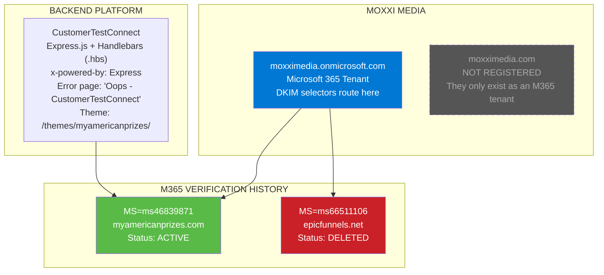

## The Victim Journey

## WHOIS Timeline

All domains in chronological order of registration.

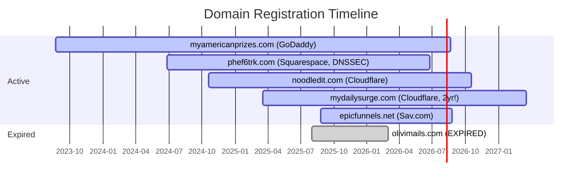

| Domain | Registrar | Created | Expires | Notes |
|--------|-----------|---------|---------|-------|
| myamericanprizes.com | GoDaddy | 2023-08-22 | 2026-08-22 | THE OG -- oldest domain, 2.5 years old |
| phef6trk.com | Squarespace | 2024-06-25 | 2026-06-25 | DNSSEC signed, Google Cloud DNS, SINKHOLED |
| noodledit.com | Cloudflare | 2024-10-18 | 2026-10-18 | Asset CDN, cert renewed 2026-04-04 |
| mydailysurge.com | Cloudflare | 2025-03-19 | 2027-03-19 | Renewed for 2 YEARS -- they're invested |
| epicfunnels.net | Sav.com | 2025-08-26 | 2026-08-26 | Lovable AI scam funnels |
| olivimails.com | -- | -- | EXPIRED | WHOIS returns "No match", domain gone |

## The Full Infrastructure

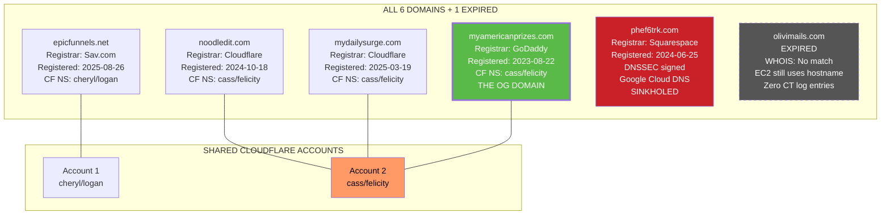

## myamericanprizes.com -- The OG Domain

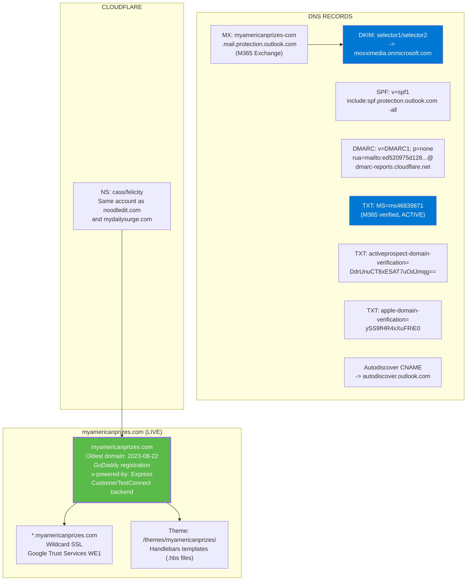

## epicfunnels.net -- Subdomains & DNS

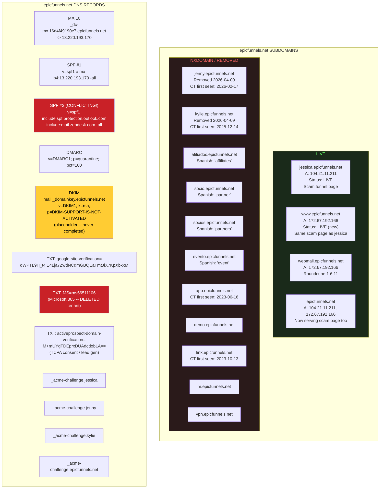

## mydailysurge.com -- The SEO Content Farm

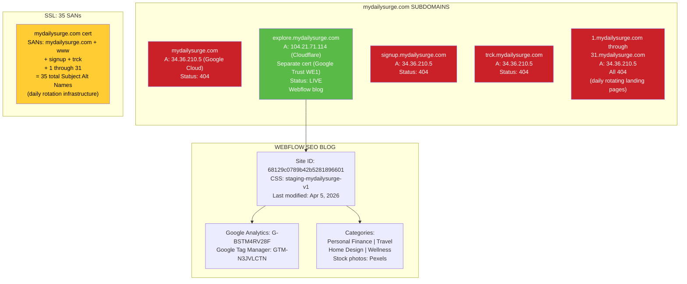

## noodledit.com -- Asset CDN / GCS Bucket Factory

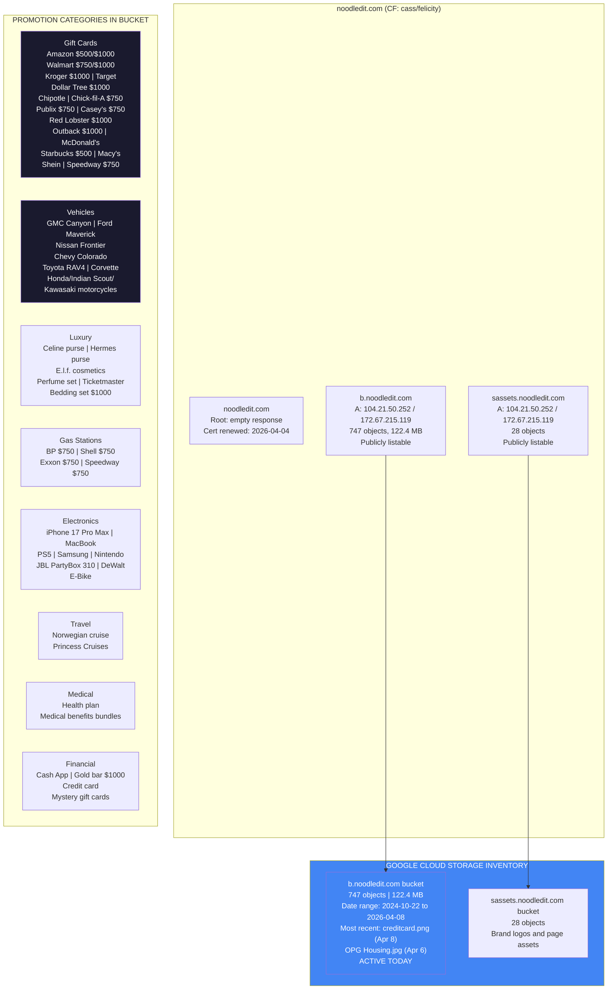

## Government Benefits Scams

A separate category of promotions targeting vulnerable people searching for government assistance.

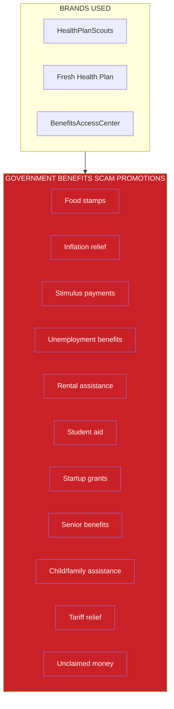

## The EC2 Server -- Every Open Port

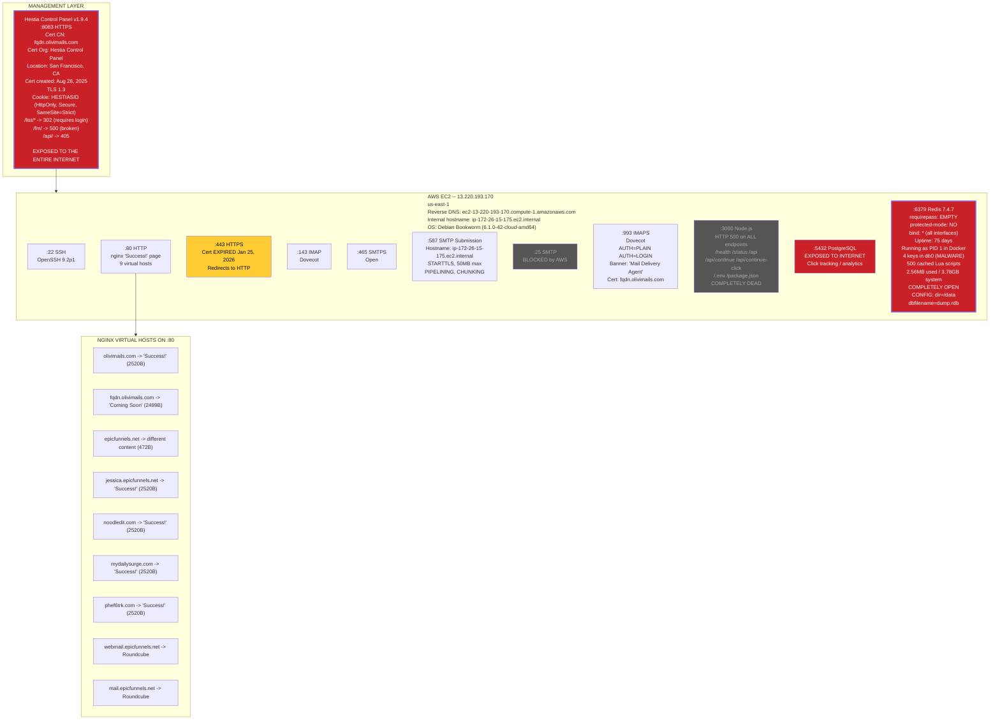

## Redis Malware -- Cryptojacking Attempt

The 4 Redis keys are crontab injection payloads from an automated botnet scanner. The attack vector: write crontab entries to Redis, then use `CONFIG SET dir/dbfilename` to overwrite the host's `/var/spool/cron/root`.

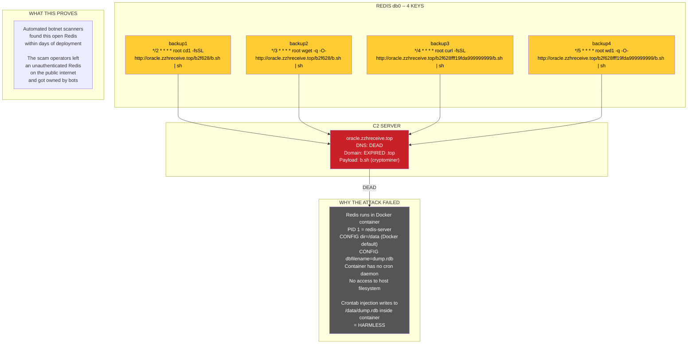

## Email Infrastructure

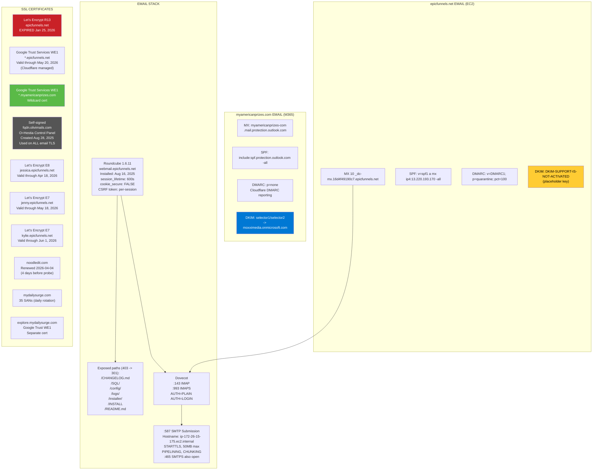

## Third-Party Integrations

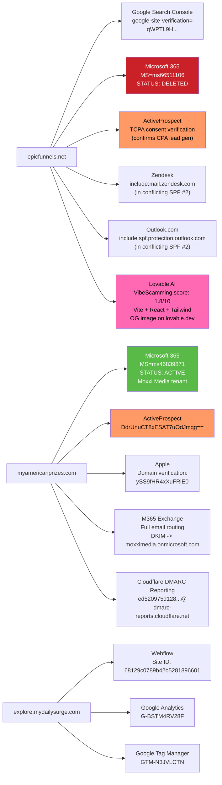

## Brands -- 15+ and Counting

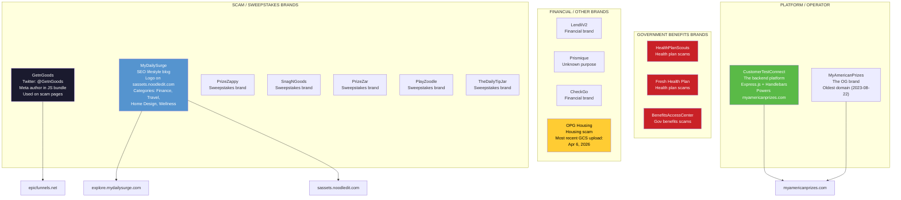

## The Scam Is Broken

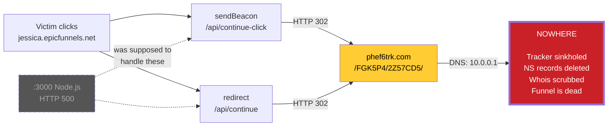

## Operator Behavior (Active Despite Being Broken)

| Action | When | Interpretation |
|--------|------|----------------|
| Registered myamericanprizes.com | Aug 22, 2023 | Operation started 2.5 YEARS ago |
| Uploaded creditcard.png to GCS | Apr 8, 2026 | Active TODAY |
| Uploaded OPG Housing.jpg to GCS | Apr 6, 2026 | Active 2 days ago |
| 747 objects in b.noodledit.com | 2024-10-22 to 2026-04-08 | Continuous asset production |
| Renewed mydailysurge.com for 2 years | 2025 | Long-term investment |
| Renewed noodledit.com SSL cert | Apr 4, 2026 | Active maintenance |
| Removed jenny.epicfunnels.net DNS | Apr 8-9, 2026 | Consolidating funnels |
| Removed kylie.epicfunnels.net DNS | Apr 8-9, 2026 | Consolidating funnels |
| Activated www.epicfunnels.net | Apr 8-9, 2026 | New landing strategy |
| Activated epicfunnels.net root | Apr 8-9, 2026 | Serving scam page on root |
| Added Redis on :6379 | ~Jan 24, 2026 | Active development |
| Updated explore.mydailysurge.com | Apr 5, 2026 | Still investing in SEO |
| Moved explore.mydailysurge.com to Cloudflare | Apr 5-8, 2026 | Infrastructure changes |
| myamericanprizes.com fully operational | Current | Express.js backend, M365 email, live |
| Let olivimails.com expire | Recent | Domain not renewed, WHOIS gone |
| Did NOT fix tracker | Still sinkholed | Doesn't know or doesn't care |
| Did NOT renew mail cert on EC2 | Expired Jan 2026 | Abandoned EC2 email operations |
| Did NOT fix Node.js app on EC2 | Still HTTP 500 | EC2 backend is dead |
| Did NOT secure Redis | No auth, got cryptojacked | Botnet found it before they did |
| Did NOT register moxximedia.com | Never registered | Only exists as M365 tenant |

## Stats

- **6** domains (+ 1 expired)
- **21** subdomains (historical) on epicfunnels.net
- **35** SANs on mydailysurge.com cert (daily rotation)
- **15+** brand names across GCS bucket
- **747** objects in b.noodledit.com bucket (122.4 MB)
- **11** open ports on EC2
- **9** nginx virtual hosts
- **10+** SSL certificates tracked
- **4** Redis keys containing cryptominer crontab payloads
- **4** DNS TXT records on epicfunnels.net
- **8** DNS TXT records on myamericanprizes.com
- **3** domains sharing cass/felicity Cloudflare account
- **2** Cloudflare accounts
- **2** M365 tenants (1 active, 1 deleted)
- **2** ActiveProspect domain verifications
- **2** conflicting SPF records on epicfunnels.net
- **1** operating entity: Moxxi Media (M365 tenant only, no domain)
- **1** backend platform: CustomerTestConnect (Express.js + Handlebars)
- **1** DKIM key that says "NOT ACTIVATED"
- **1** sinkholed tracker
- **1** dead Node.js app on EC2
- **1** completely open Redis (cryptojacked by bots)
- **1** PostgreSQL database on the public internet
- **1** admin panel exposed to the world
- **1** expired domain (olivimails.com, WHOIS gone)
- **1** dead C2 server (oracle.zzhreceive.top)
- **0** working parts of the epicfunnels.net scam funnel
- **1** fully operational site: myamericanprizes.com
