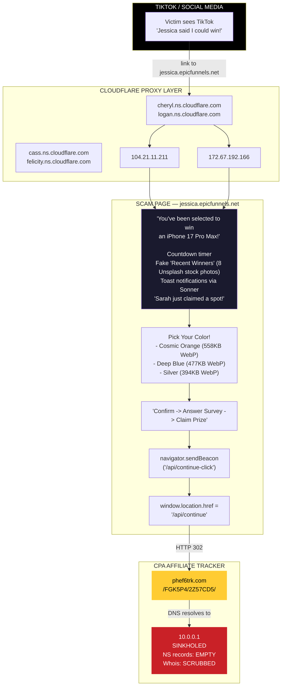
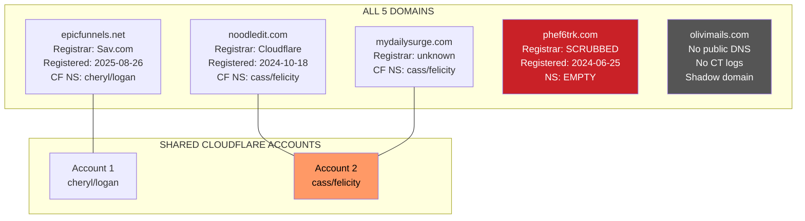
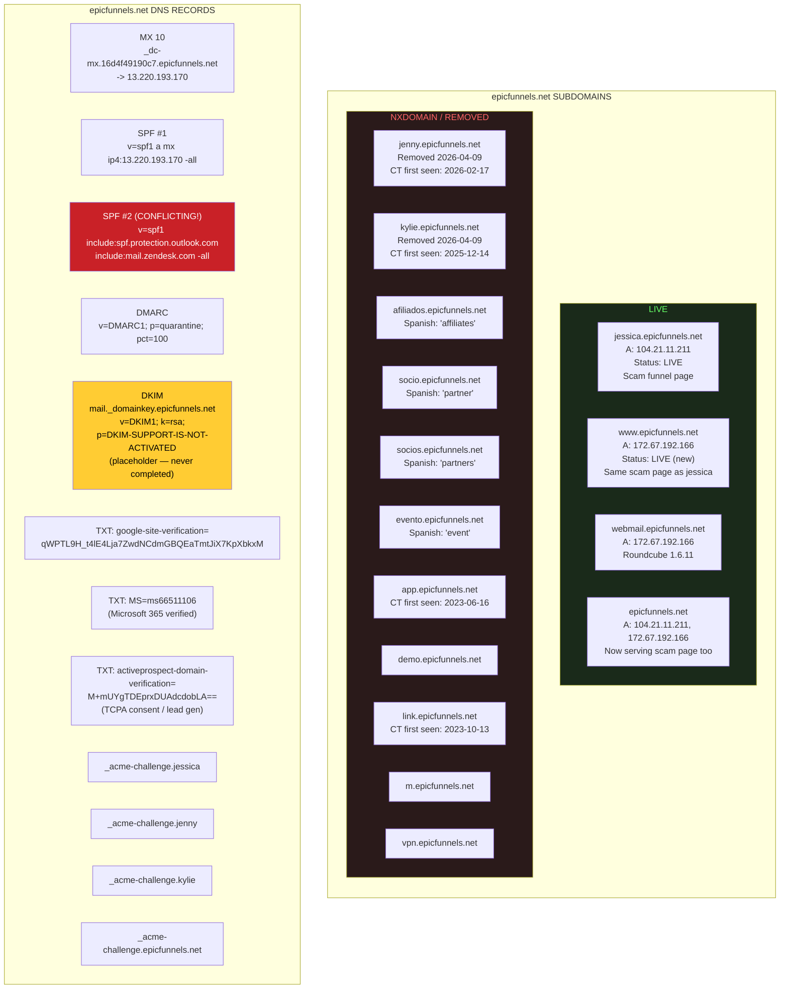
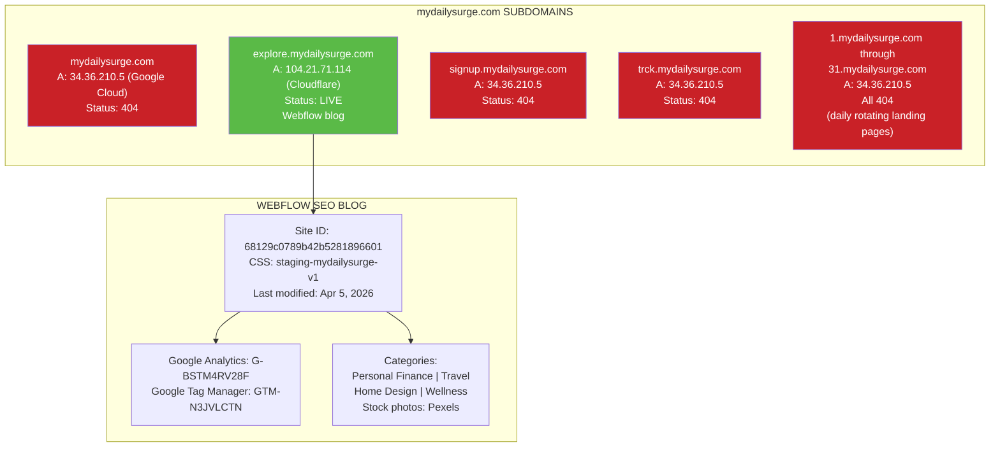
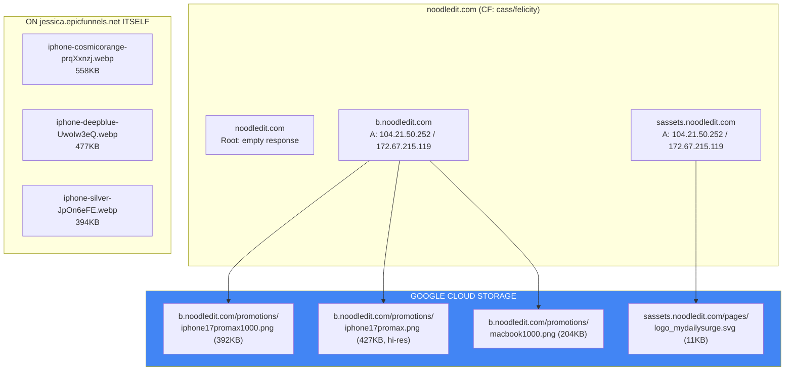
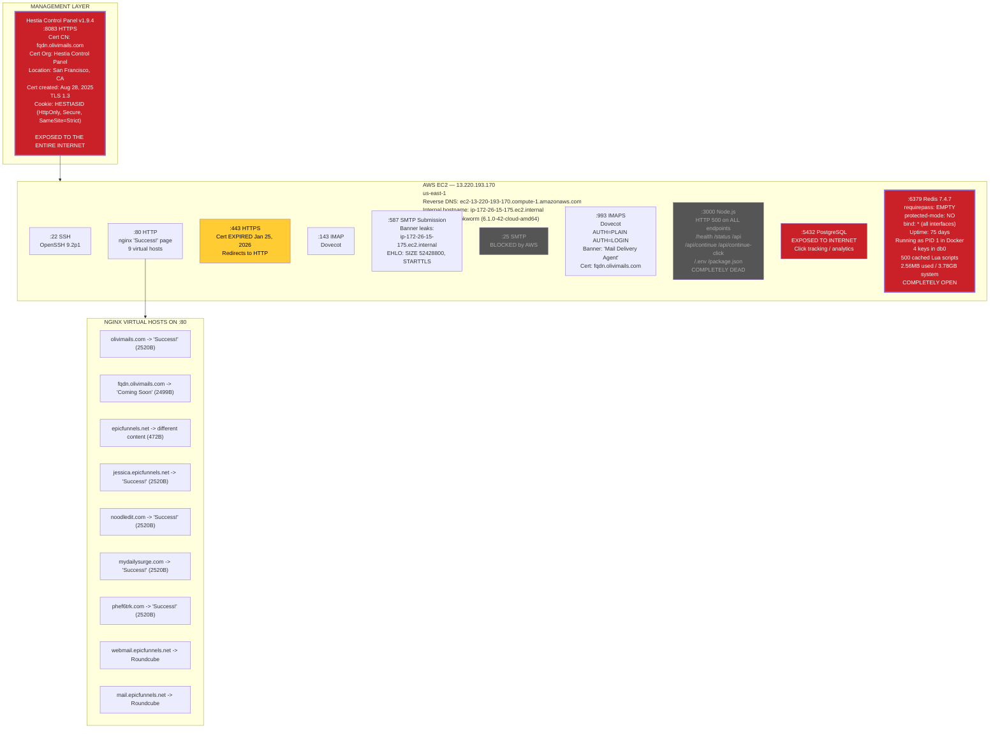
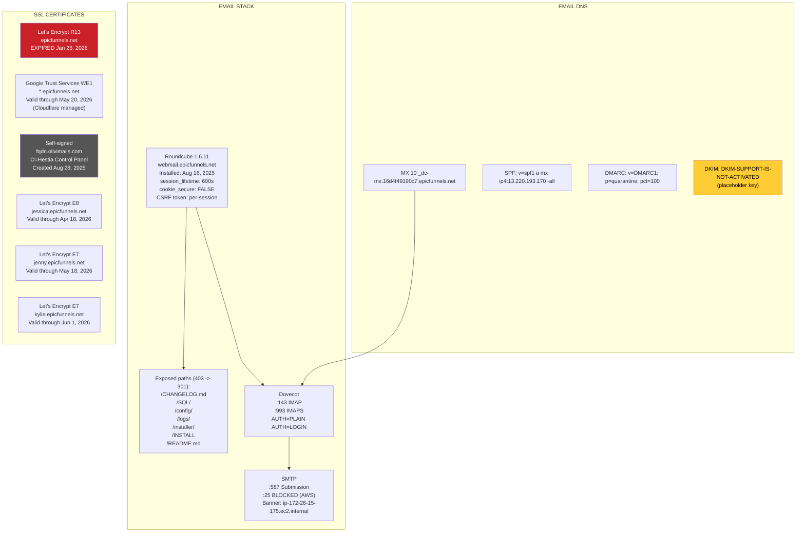
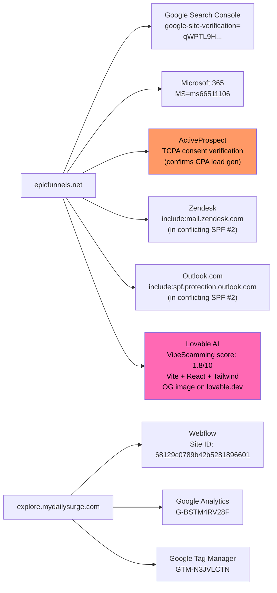
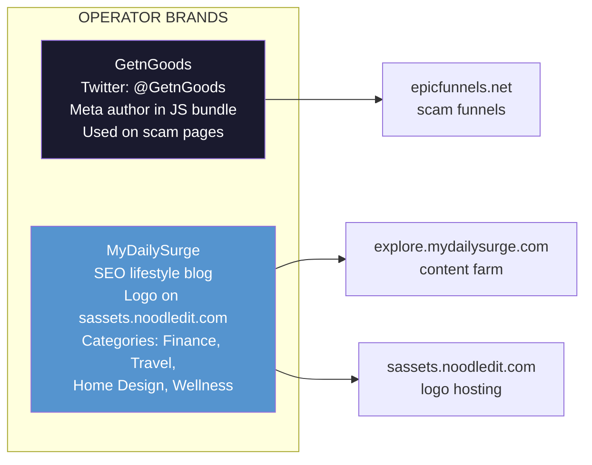
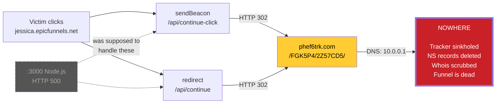

# The Complete Scam Flow

A comprehensive map of every domain, subdomain, DNS record, service, page, and connection in the epicfunnels.net CPA scam operation.

## The Victim Journey

## The Full Infrastructure

## epicfunnels.net — Subdomains & DNS

## mydailysurge.com — The SEO Content Farm

## noodledit.com — Asset CDN

## The EC2 Server — Every Open Port

## Email Infrastructure

## Third-Party Integrations

## Brands

## The Scam Is Broken

## Operator Behavior (Active Despite Being Broken)

| Action | When | Interpretation |
|--------|------|----------------|
| Removed jenny.epicfunnels.net DNS | Apr 8-9, 2026 | Consolidating funnels |
| Removed kylie.epicfunnels.net DNS | Apr 8-9, 2026 | Consolidating funnels |
| Activated www.epicfunnels.net | Apr 8-9, 2026 | New landing strategy |
| Activated epicfunnels.net root | Apr 8-9, 2026 | Serving scam page on root |
| Added Redis on :6379 | ~Jan 24, 2026 | Active development |
| Updated explore.mydailysurge.com | Apr 5, 2026 | Still investing in SEO |
| Moved explore.mydailysurge.com to Cloudflare | Apr 5-8, 2026 | Infrastructure changes |
| Did NOT fix tracker | Still sinkholed | Doesn't know or doesn't care |
| Did NOT renew mail cert | Expired Jan 2026 | Abandoned email operations |
| Did NOT fix Node.js app | Still HTTP 500 | Backend is dead |
| Did NOT secure Redis | No auth, all interfaces | Classic |

## Stats

- **5** domains
- **21** subdomains (historical)
- **11** IP addresses
- **10** open ports on EC2
- **9** nginx virtual hosts
- **6** SSL certificates
- **4** DNS TXT records
- **3** third-party verifications
- **2** Cloudflare accounts
- **2** brands
- **2** conflicting SPF records
- **1** DKIM key that says "NOT ACTIVATED"
- **1** sinkholed tracker
- **1** dead Node.js app
- **1** completely open Redis
- **1** PostgreSQL database on the public internet
- **1** admin panel exposed to the world
- **0** working parts of the actual scam
